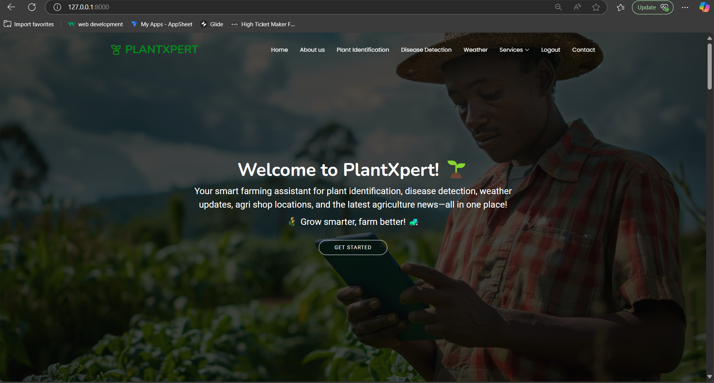

# 🌿 PlantXpert Web App

**PlantXpert** is a smart, AI-powered web platform designed for farmers, agricultural researchers, and enthusiasts. It provides real-time intelligent farming solutions using Machine Learning, Deep Learning, and APIs. From plant identification to water requirement prediction, everything is bundled into a secure and easy-to-use web interface.

---

## 📸 Features

| Feature                      | Description                                                      |
| ---------------------------- | ---------------------------------------------------------------- |
| 🌱 Plant Identification      | Identify plant species from uploaded images using ML models      |
| 🦠 Disease Detection         | Detect plant diseases and recommend cures/pesticides             |
| 🐛 Pest Detection            | Detect pest type from images and suggest pesticides              |
| ☁️ Weather Updates           | Get real-time weather data using OpenWeatherMap API              |
| 🗺️ Nearby Agri Shops        | Locate agri shops around you using Google Maps API               |
| 📰 Agriculture News          | Stay updated with the latest agri-news using NewsAPI             |
| 🤖 AI Assistant (Chatbot)    | Chat with an AI assistant (Gemini AI) for agri-related queries   |
| 🌾 Crop Recommendation       | Suggest best-suited crops using soil and climate data            |
| 📊 Crop Yield Prediction     | Estimate crop yield using ML models based on environment & input |
| 💧 Water Requirement         | Predict how much water is required for a crop                    |
| 🧪 Fertilizer Recommendation | Get fertilizer suggestions based on soil nutrients and crop type |

---

## 🔐 User Authentication

To use **any feature**, the user must first **register or log in**:

* **Register**: Sign up with a valid email and password.
* **Login**: Secure access with session tracking.
* **Protected Routes**: All feature routes are protected behind authentication.

---

## 🌍 Live Demo

🌐 [Live Demo Link](https://your-live-demo-link.com)

> You must register/login to try the features. For demo access, you can use:
>
> * **Email**: [demo@plantxpert.com](mailto:demo@plantxpert.com)
> * **Password**: Demo1234

---

## 💻 Local Setup Instructions

To run this project locally:

### 1. Clone the Repository

```bash
git clone https://github.com/yourusername/plantxpert.git
cd plantxpert
```

### 2. Create a Virtual Environment

```bash
python -m venv venv
source venv/bin/activate  # For Linux/macOS
venv\Scripts\activate     # For Windows
```

### 3. Install Dependencies

```bash
pip install -r requirements.txt
```

### 4. Setup Database

```bash
python manage.py makemigrations
python manage.py migrate
```

### 5. Run the Server

```bash
python manage.py runserver
```

Visit `http://127.0.0.1:8000` in your browser.

---

## 🧠 Tech Stack

* **Frontend**: HTML5, CSS3, Bootstrap, JavaScript
* **Backend**: Django, Python
* **AI/ML**: TensorFlow, Scikit-learn, OpenCV, Keras
* **APIs**:

  * OpenWeatherMap (Weather)
  * Google Maps (Nearby Shops)
  * NewsAPI (Agri News)
  * Gemini API (AI Chatbot)
* **Database**: PostgreSQL (or SQLite for dev)
* **Deployment**: Render / Vercel / Heroku (Optional)

---

🎥 Live Demo Video  
[](https://www.youtube.com/watch?v=_YNgk7NjiMs)


## 📷 Screenshots (Optional)

> You can add screenshots in a `/screenshots` folder and link them here:




---

## 👨‍💻 How it Works

1. **User logs in** → Authenticated session is created.
2. **Selects service** (e.g., Disease Detection) → Uploads image/input.
3. **Backend ML/DL model processes input** → Generates result.
4. **Output is displayed** → Along with relevant advice (e.g., pesticide, yield estimate, chatbot help).
5. **Users can interact with AI assistant anytime.**

---

## 🙌 Contributors

* 👨‍💻 [Mekapothula venu](https://github.com/Mekapothulavenu/)
* 👩‍💻 [Collaborator Name](https://github.com/collaboratorusername)
* 👩‍💻 [Collaborator Name](https://github.com/collaboratorusername)

---

## 📄 License

This project is licensed under the **MIT License**.
You are free to use, modify, and distribute this project for personal and commercial use.

---

## 🤝 Support & Feedback

Got ideas, suggestions, or facing an issue?

* 📧 Email: [support@plantxpert.ai](venum8957@gmail.com)
* 🐞 Open an [Issue](https://github.com/yourusername/plantxpert/issues)
* 💬 Join our community forum (coming soon)
